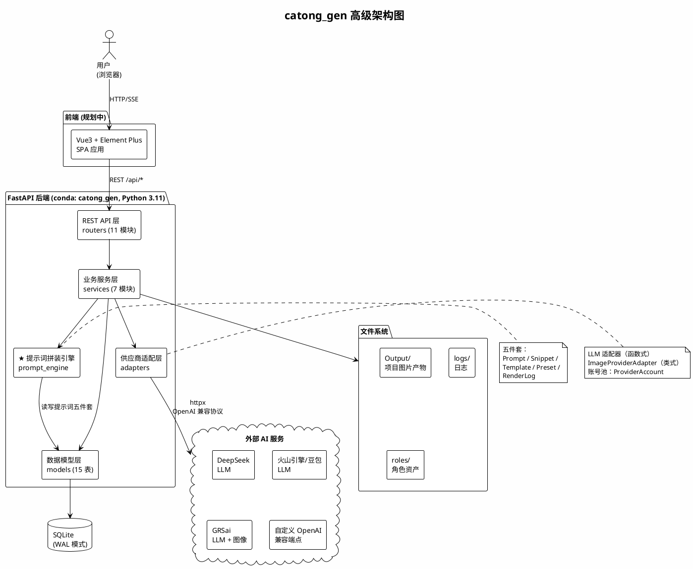
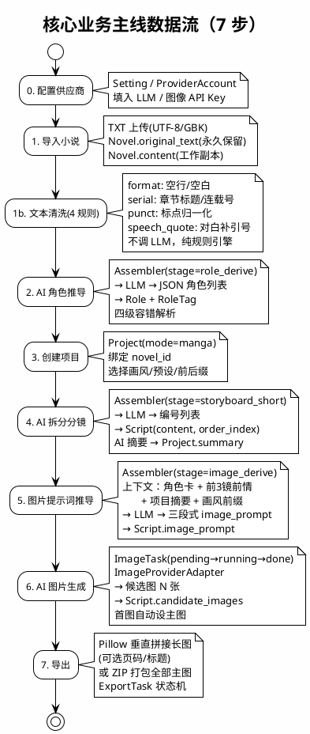
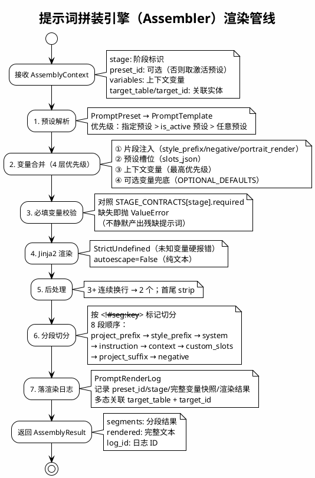
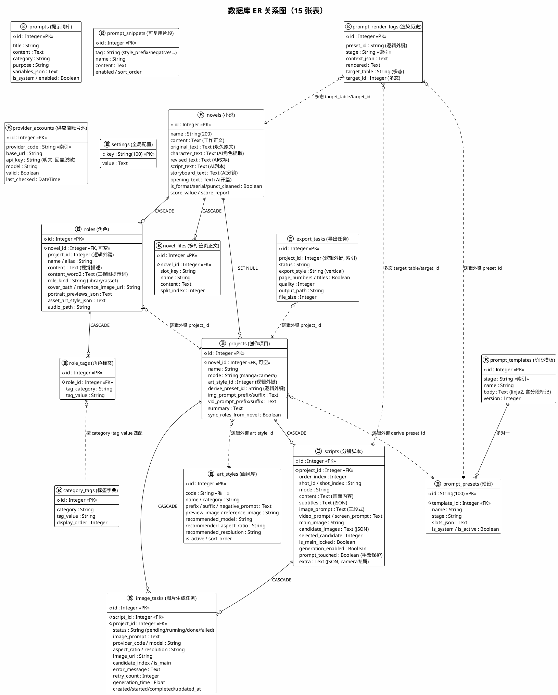
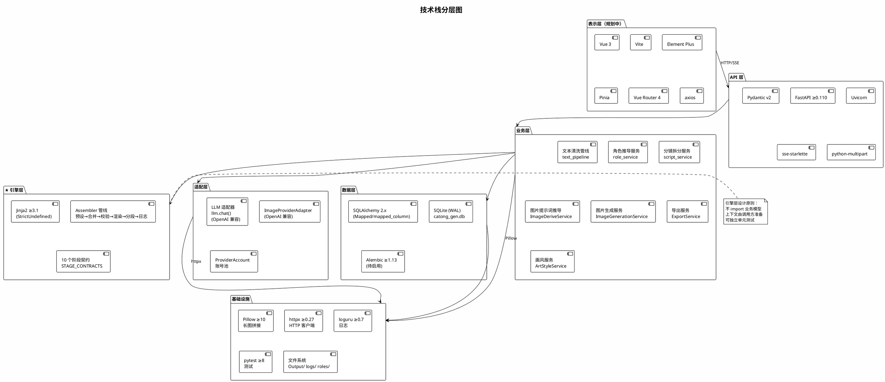
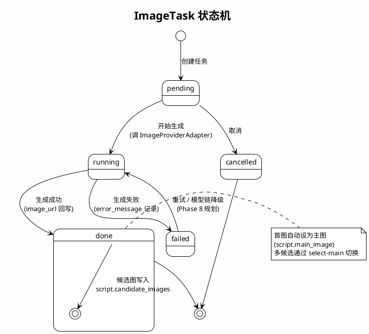

<!-- [AGC:FILE] tool=Cc author=fangkun date=2026-08-16 -->
# catong_gen（卡通生成器）架构说明

> 本文档结合 `设计文档/` 中的设计意图与 `backend/app/` 的实际代码实现，对项目整体架构进行分析说明。
> 分析基准：Phase 0~8 已落地（49 项单测 + 80 项端到端冒烟测试全过）。

---

## 一、执行摘要

**catong_gen** 是对桌面应用 **雪漫画（CineGacha）v1.8.16.26** 的 Web 化复刻，核心业务是将小说/网文原文经 AI 流水线自动转化为**全彩条漫分镜图片**（未来扩展到动漫短视频）。

系统采用 **B/S 架构**：后端基于 **FastAPI + SQLAlchemy + SQLite**，前端规划为 **Vue3 + Element Plus**（尚未实施，当前仅后端 + API 文档可用）。系统以**提示词五件套（库/片段/模板/预设/渲染历史）+ 拼装引擎**为核心地基，串联起"小说导入 → 文本清洗 → 角色推导 → 项目分镜 → 图片提示词推导 → AI 生图 → 长图导出"的完整内容生产主线。

一句话概括：`小说 → 清洗 → 角色卡 → 分镜 → 提示词 → 候选图 → 长图`。

---

## 二、业务功能

### 2.1 核心业务主线（7 步）

| 步骤 | 功能 | 说明 |
|------|------|------|
| 0 | 供应商配置 | 在设置中心填入 LLM / 图像 API Key（一次配置） |
| 1 | 小说导入与清洗 | TXT 上传（UTF-8/GBK 自适应）/ 粘贴；规则引擎清洗（格式、连载号、标点、对白引号） |
| 2 | AI 角色推导 | LLM 从小说正文推导角色视觉描述，输出角色卡列表（含标签） |
| 3 | 创建项目 | 绑定小说、选择模式（manga 漫画 / camera 镜头）、画风、推导预设、前后缀 |
| 4 | AI 拆分分镜 | LLM 将正文拆分为编号分镜列表（短句版/长句版两种预设） |
| 5 | 图片提示词推导 | LLM 结合角色卡、前情分镜、画风前缀，产出三段式 image_prompt |
| 6 | 图片生成 | 调用图像供应商 API，每镜生成多张候选图，点选主图 |
| 7 | 导出 | Pillow 垂直拼接长图（可选页码/标题），或 ZIP 打包全部主图 |

### 2.2 功能模块清单

| 模块 | 状态 | 说明 |
|------|------|------|
| 提示词五件套 | ✅ 已完成 | 库/片段/模板/预设/渲染历史，系统条目只可 fork 不可删改 |
| 提示词拼装引擎 | ✅ 已完成 | 分段渲染管线、Jinja2 变量渲染、阶段契约校验、渲染留痕 |
| 小说中心 | ✅ 已完成 | TXT 导入、多标签页正文、4 规则清洗管线、原文与工作副本分离 |
| 角色中心 | ✅ 已完成 | AI 角色推导（四级容错解析）、角色卡 CRUD、标签字典 |
| 项目与分镜 | ✅ 已完成 | 项目 CRUD、AI 分镜拆分、AI 摘要、Script CRUD、重排、prompt_touched 保护 |
| 图片提示词推导 | ✅ 已完成 | 上下文注入（角色卡+前情+摘要+画风）、三段式 LLM 生成、批量推导 |
| 图片生成 | ✅ 已完成 | 任务状态机、供应商适配器、单镜/批量生成、候选图管理、主图选择 |
| 导出功能 | ✅ 已完成 | Pillow 长图拼接、ZIP 打包、页码/标题可选 |
| 画风库 | ✅ 已完成 | 画风 CRUD、项目绑定、提示词前缀/后缀注入 |
| 供应商账号池 | ✅ 已完成 | LLM/图像供应商多账号管理、API Key 脱敏回显 |
| 前端（Vue3） | ⏳ 规划中 | 仅 README 占位，尚未搭建脚手架 |
| 视频模式 / TTS | 📋 后期 | camera 模式分镜、文生视频、配音、FFmpeg 合成 |
| 高清放大 | 📋 后期 | Real-ESRGAN 集成 |
| 批量调度/模型链降级 | 📋 部分完成 | 批量已支持；失败重试与模型链降级雏形待完善 |

---

## 三、技术栈

### 3.1 后端技术栈（已实施）

| 类别 | 技术 | 版本 | 用途 |
|------|------|------|------|
| 语言 | Python | 3.11（conda 环境 `catong_gen`） | 业务逻辑与 AI 流水线 |
| Web 框架 | FastAPI | ≥0.110 | REST API、自动 OpenAPI 文档 |
| ASGI 服务器 | Uvicorn | ≥0.29 | 运行 FastAPI 应用（端口 8300） |
| 数据校验 | Pydantic | v2 | 请求/响应模型校验 |
| ORM | SQLAlchemy | 2.x（Mapped/mapped_column 风格） | 数据库访问 |
| 数据库 | SQLite | 内置（WAL 模式） | 本地优先数据存储 |
| 数据库迁移 | Alembic | ≥1.13 | 表结构演进（当前用 create_all，未正式启用） |
| HTTP 客户端 | httpx | ≥0.27 | 调用 LLM / 图像 API |
| 模板引擎 | Jinja2 | ≥3.1 | 提示词模板变量渲染（StrictUndefined） |
| SSE | sse-starlette | ≥2.0 | 实时进度推送（已引入，业务使用待完善） |
| 图像处理 | Pillow | ≥10.2 | 长图拼接、JPEG 导出 |
| 文件上传 | python-multipart | ≥0.0.9 | TXT 文件上传解析 |
| 日志 | loguru | ≥0.7 | 结构化日志 |
| 测试框架 | pytest | ≥8.0 | 单元测试与端到端测试 |

### 3.2 前端技术栈（规划中，未实施）

| 类别 | 技术 | 用途 |
|------|------|------|
| 框架 | Vue 3 + Vite | SPA 应用 |
| UI 库 | Element Plus | 表格/表单/抽屉等管理型组件 |
| 状态管理 | Pinia | 全局状态 |
| 路由 | Vue Router 4 | 前端路由 |
| HTTP | axios | API 调用 |

### 3.3 外部服务集成

| 服务类型 | 供应商 | 接入方式 |
|----------|--------|----------|
| LLM | DeepSeek | OpenAI 兼容协议（/chat/completions） |
| LLM | 火山引擎（豆包） | OpenAI 兼容协议 |
| LLM | GRSai | OpenAI 兼容协议 |
| LLM | 任意自定义端点 | OpenAI 兼容协议（base_url 可配） |
| 图像生成 | GRSai（nano-banana-2） | OpenAI 兼容协议（/images/generations） |
| 图像生成 | 任意 OpenAI 兼容端点 | 统一 ImageProviderAdapter 抽象 |

---

## 四、技术-问题映射

| 技术 | 解决的业务问题 | 解决的技术问题 | 备选方案与选型理由 |
|------|---------------|---------------|-------------------|
| **FastAPI** | 快速提供 REST API 支撑 Web 化 | 原生 async、Pydantic 自动校验、自动 OpenAPI 文档 | 备选 Django/Flask；FastAPI 更轻量，原生支持 SSE 和异步，适合 AI 长任务场景 |
| **SQLAlchemy 2.x** | 对标源应用（源库即 SQLAlchemy） | ORM 抽象、支持同步/异步、类型安全（Mapped 注解） | 备选 Tortoise ORM；SQLAlchemy 生态最成熟，与源库一致便于迁移 |
| **SQLite + WAL** | 本地优先、零部署 | WAL 模式提升并发读性能；单文件便于备份 | 备选 PostgreSQL；首期单机自用无需独立数据库，后期可切换 |
| **Jinja2 + StrictUndefined** | 提示词模板动态渲染 | 变量缺失硬报错，避免静默产出残缺提示词 | 备选字符串 format；Jinja2 支持条件/循环，满足角色列表、前情分镜等复杂渲染 |
| **OpenAI 兼容适配层** | 多供应商 LLM/图像接入 | 一套接口接入 DeepSeek/火山/GRSai 及任意兼容端点 | 备选各家专属 SDK；统一协议大幅降低适配成本，新增供应商只需配置 base_url |
| **Pillow** | 长图拼接导出 | 纯 Python 图像处理，无重量级依赖 | 备选 OpenCV（过重）；Pillow 足够满足垂直拼接需求 |
| **httpx** | 调用外部 AI API | 同步/异步双模式、超时控制、连接池 | 备选 requests；httpx 原生支持 async，与 FastAPI 配合更好 |
| **提示词五件套** | 业务代码不硬编码提示词 | 提示词可编辑、可版本化、可 fork、可审计 | 源应用将提示词散落在 prompts 表和 settings 中；本项目体系化为五件套，所有 AI 阶段统一管理 |
| **任务状态机（ImageTask）** | 图片生成异步可追溯 | pending→running→done/failed 全生命周期追踪 | 源应用任务表基本闲置；Web 化后必须任务驱动以支持 HTTP 轮询/SSE |
| **PromptRenderLog** | 提示词渲染可追溯、可调试 | 每次 AI 调用记录完整变量快照与渲染结果 | 源应用有 manga_derive_llm_raw_log；本项目强化为多态 target_table/target_id，任意业务实体可关联 |
| **conda 环境** | 环境一致性 | 环境名=项目名，Python 3.11 锁定 | 备选 venv/Docker；conda 更适合数据科学/AI 生态，用户明确要求 |

---

## 五、架构概述

### 5.1 分层架构

系统采用经典的**分层架构 + 领域模块化**组织：

```
┌─────────────────────────────────────────────────────┐
│                    浏览器（规划中）                     │
│              Vue3 + Element Plus + Pinia             │
└──────────────────────┬──────────────────────────────┘
                       │ HTTP / SSE
┌──────────────────────▼──────────────────────────────┐
│              FastAPI 路由层（routers/）                │
│  11 个路由模块：参数校验、DB 注入、异常→HTTP 映射       │
├─────────────────────────────────────────────────────┤
│              业务服务层（services/）                    │
│  text_pipeline / role_service / script_service /     │
│  image_derive / image_generation / export /          │
│  art_style                                           │
├─────────────────────────────────────────────────────┤
│           ★ 提示词拼装引擎（prompt_engine/）            │
│  Assembler 管线：预设→变量合并→校验→Jinja2渲染→       │
│  分段切分→渲染留痕（纯逻辑，不依赖业务模型）             │
├─────────────────────────────────────────────────────┤
│           供应商适配层（adapters/）                     │
│  llm.py（函数式，OpenAI 兼容）                         │
│  image_provider.py（类封装，OpenAI 兼容）              │
├─────────────────────────────────────────────────────┤
│           数据模型层（models/）                         │
│  15 张表：novel/project/script/role/prompt/...        │
│  SQLAlchemy 2.x ORM + SQLite（WAL）                   │
├─────────────────────────────────────────────────────┤
│           基础设施                                      │
│  SQLite 文件 / Output 文件系统 / logs / 种子数据        │
└─────────────────────────────────────────────────────┘
```

### 5.2 后端代码结构

```
backend/
├── app/
│   ├── main.py                    # FastAPI 入口，挂载 11 个路由
│   ├── config.py                  # 路径与数据库配置（env 可覆盖）
│   ├── database.py                # SQLAlchemy engine/session，SQLite WAL
│   ├── models/                    # 15 个 ORM 实体（9 个文件）
│   │   ├── novel.py               # Novel, NovelFile
│   │   ├── project.py             # Project, Script
│   │   ├── role.py                # Role, RoleTag, CategoryTag
│   │   ├── prompt.py              # Prompt, PromptSnippet, PromptTemplate,
│   │   │                          #   PromptPreset, PromptRenderLog
│   │   ├── provider.py            # Setting, ProviderAccount
│   │   ├── image.py               # ImageTask
│   │   ├── export.py              # ExportTask
│   │   └── art_style.py           # ArtStyle
│   ├── routers/                   # 11 个 API 路由模块
│   ├── services/                  # 7 个业务服务
│   ├── prompt_engine/             # ★ 拼装引擎（assembler.py，298 行）
│   ├── adapters/                  # LLM / 图像供应商适配
│   └── seeds/                     # 种子数据（seed.py，286 行）
├── tests/                         # 单元测试 + 端到端测试
└── requirements.txt
```

### 5.3 组件交互模式

项目中存在**两种交互模式并存**：

- **模式 A（旧模块）**：路由直连 ORM。`prompts.py`、`novels.py`、`roles.py`、`settings.py`、`projects.py` 的 CRUD 部分直接操作模型；涉及 AI 逻辑时调用服务层函数。
- **模式 B（新模块，Phase 4+）**：路由 → Service 类（依赖注入风格）。`image_derive`、`image_generation`、`export`、`art_styles` 采用 `XxxService(db)` 类封装，路由层负责异常到 HTTP 状态码的映射。

所有 LLM 相关服务遵循统一范式：
```
Assembler(db).assemble(AssemblyContext(stage, variables))
  → result.rendered
  → chat(db, prompt, ...)
  → 解析输出 → 落库
```

---

## 六、架构图

### 6.1 高级架构图（PlantUML）



### 6.2 核心业务数据流图（PlantUML）



### 6.3 提示词拼装引擎管线图（PlantUML）



### 6.4 数据库 ER 关系图（PlantUML）



### 6.5 技术栈分层图（PlantUML）



### 6.6 图片生成状态机图（PlantUML）



---

## 七、关键技术决策

### 7.1 提示词与业务解耦（核心设计）

源应用把 13 条指令散落在 `prompts` 表、settings 和硬编码中。本项目将其体系化为**五件套**：

| 组件 | 表 | 职责 |
|------|-----|------|
| 提示词库 | `prompts` | 指令条目（分类、用途、变量声明、系统/用户） |
| 片段 | `prompt_snippets` | 可复用文本块（画风前缀、负面词、三视图渲染词） |
| 模板 | `prompt_templates` | 阶段主体指令（Jinja2 + `<!--#seg:key-->` 分段标记，版本自增） |
| 预设 | `prompt_presets` | 阶段+模板+槽位的绑定（字符串主键，激活制） |
| 渲染历史 | `prompt_render_logs` | 每次渲染的完整变量快照与结果（可审计、可回放） |

业务代码永不硬编码提示词，所有 AI 调用都走"预设 + 上下文 → 拼装引擎 → LLM"。新增 AI 阶段只需新增模板和预设，无需改引擎代码。

### 7.2 拼装引擎的纯函数设计

`prompt_engine/assembler.py` 明确注释"引擎不 import 业务模型"，上下文由调用方准备好传入。这使得引擎可以独立单元测试，不依赖数据库状态。引擎的 7 步管线（预设解析→变量合并→必填校验→Jinja2渲染→后处理→分段切分→落日志）对所有 AI 阶段统一适用。

### 7.3 系统条目保护与 Fork 机制

系统提示词（`is_system=True`）禁止删除；编辑时自动 fork 为用户副本，原条目不动。这保证了种子数据（源库迁移的 13 条提示词）不会被误改，同时允许用户自定义。

### 7.4 工作副本与原文分离

`Novel.original_text` 永久保留导入时的原文，所有清洗和手工编辑只改 `Novel.content`。这使得清洗操作可预览（unified diff）、可回溯，AI 各阶段产物（character_text/revised_text/script_text 等）各自独立时间戳，支持单独重跑。

### 7.5 prompt_touched 手改保护

当用户手工编辑了 `Script.image_prompt` 时，置 `prompt_touched=True`，防止后续 AI 批量推导覆盖人工修改。这是人机协作场景的重要保护机制。

### 7.6 单表多态（mode + extra JSON）

Script 表用 `mode` 字段（manga/camera）+ `extra` JSON 字段支持两种分镜模式，而非源应用的双表设计（scripts_list/scripts_camera）。这避免了稀疏列问题，同时简化了查询。camera 模式的专属字段放 extra JSON。

### 7.7 供应商统一抽象

LLM 和图像供应商都基于 **OpenAI 兼容协议**接入，新增供应商只需配置不同的 `base_url` + `api_key` + `model`，无需写新代码。`ProviderAccount` 表支持账号池，API Key 回显时只显示尾 6 位。

### 7.8 多态渲染日志

`PromptRenderLog` 用 `target_table` + `target_id` 实现多态关联，可以指向任意业务表（scripts、novels、roles 等）的任意一行，实现了跨模块的提示词渲染审计。

---

## 八、代码观察与建议

> 以下基于代码审查的观察，供后续迭代参考。

### 8.1 已发现的代码质量问题

| 问题 | 位置 | 说明 |
|------|------|------|
| 函数重复定义 | `services/image_generation.py` 末尾 | `get_task` 和 `list_tasks` 各重复定义 3 次，后者覆盖前者，属冗余代码 |
| 重复路由 | `routers/images.py` 与 `routers/image_generation.py` | 新旧两套接口风格并存，底层同一服务，建议后续废弃旧版 |
| 冗余导入 | `models/__init__.py` | `ArtStyle` 重复导入 |
| 批量并发未实现 | `adapters/image_provider.py` | `generate_batch(concurrency=5)` 参数存在，但实际串行执行（代码注释已说明） |
| 导出同步执行 | `routers/export.py` | `create_export_task` 同步执行 PIL 拼接，大项目可能阻塞 HTTP 请求 |
| API Key 明文存储 | `models/provider.py` | `api_key` 字段明文存储数据库，单机自用场景可接受，但建议后续加密 |

### 8.2 架构成熟度观察

- **分层一致性**：新旧模块交互模式不统一（直连 ORM vs Service 类），建议后续重构旧模块向 Service 类模式靠拢。
- **ORM 关系**：全部模型只声明 `ForeignKey`，未使用 SQLAlchemy `relationship()`，关联查询由应用层手动完成。对于当前规模足够，但复杂查询会增加代码量。
- **Alembic 未正式启用**：当前启动时用 `Base.metadata.create_all()` 建表，模型演进后需引入 Alembic 迁移。
- **异步支持**：FastAPI 原生 async，但 LLM/图像调用是同步阻塞式（httpx.Client），高并发场景需改为 async（httpx.AsyncClient）或引入任务队列。
- **前端缺失**：前端仅有 README 占位，当前只能通过 `/docs` Swagger UI 操作 API，是 MVP 可用性的最大缺口。

### 8.3 安全观察

- CORS 配置为 `allow_origins=["*"]`，单机自用场景可接受，部署时应收窄。
- 无认证/鉴权机制（设计文档明确"单机自用，不做用户体系"）。
- SQL 注入风险低（全程使用 SQLAlchemy ORM 参数化查询）。
- 文件上传仅支持 TXT，有编码自适应处理。

### 8.4 后续路线建议

| 优先级 | 建议 | 对应 Phase |
|--------|------|-----------|
| 高 | 搭建前端脚手架，先落地提示词库页和拼装调试台 | Phase 1 收尾 |
| 高 | 启用 Alembic 迁移管理 | Phase 8+ |
| 中 | LLM/图像调用改为 async，或引入后台任务队列 | Phase 8+ |
| 中 | 清理重复代码（get_task/list_tasks、冗余导入） | 随时 |
| 中 | 统一新旧路由，废弃 images.py 旧版 | Phase 8 |
| 低 | API Key 加密存储 | 部署前 |
| 低 | 实现 generate_batch 真实并发 | Phase 8 |
| 低 | 导出改为异步任务 + SSE 进度推送 | Phase 8 |

---

## 九、阶段契约与 API 总览

### 9.1 拼装引擎 10 个阶段契约

| stage | 名称 | 必填变量 | 输出格式 |
|-------|------|---------|---------|
| `role_derive` | 角色视觉推导 | `novel_text` | json_roles |
| `role_portrait` | 角色三视图 | `role_content` | text |
| `storyboard_short` | 分镜拆分-短句版 | `novel_text` | numbered_list |
| `storyboard_long` | 分镜拆分-长句版 | `novel_text` | numbered_list |
| `dialogue_split` | 旁白/对白分离 | `novel_text` | tagged_lines |
| `rewrite` | 文案同义改写 | `novel_text` | plain_text |
| `image_derive` | 图片提示词推导 | `shot_content`, `style_prefix` | three_part_text |
| `video_derive` | 视频提示词推导 | `shot_content` | shot_table |
| `summary` | 项目摘要 | `novel_text` | plain_text |
| `image_request` | 图片生成请求拼装 | `image_prompt` | text |

### 9.2 API 路由模块（11 个，全部挂载 /api 前缀）

| 路由模块 | 前缀 | 核心端点 |
|----------|------|---------|
| `prompts.py` | `/api` | 提示词库/分类/片段/模板/预设 CRUD、fork、导入导出、激活 |
| `assemble.py` | `/api` | 阶段契约、拼装预览、渲染历史 |
| `novels.py` | `/api` | 小说 CRUD、TXT 导入、清洗预览/应用、多标签页文件 |
| `roles.py` | `/api` | 角色 CRUD、标签、AI 推导、标签字典 |
| `settings.py` | `/api` | K/V 设置、供应商账号池管理 |
| `projects.py` | `/api` | 项目 CRUD、AI 分镜拆分、AI 摘要、分镜 CRUD/重排 |
| `image_derive.py` | `/api/image-derive` | 单镜/批量图片提示词推导、预设列表 |
| `images.py` | `/api/images` | 单镜/批量生图、选主图、候选图（旧版风格） |
| `image_generation.py` | `/api/image-generation` | 生图、批量、选主图、候选图、任务查询（新版风格） |
| `export.py` | `/api/export` | 创建导出任务、下载、ZIP 打包、任务查询、导出前检查 |
| `art_styles.py` | `/api/art-styles` | 画风 CRUD、绑定项目、按项目查询、分类 |

### 9.3 种子数据初始化

`python -m app.seeds.seed` 幂等初始化 7 类数据：

1. 13 条源库提示词迁移
2. 3 条取证片段（负面水印禁令、默认画风前缀、三视图渲染词）
3. 8 个阶段模板（5 个迁移 + 3 个内置）
4. 8 个预设（7 个激活，对齐源系统）
5. 8 条分类标签（类型×3 + 时空×5）
6. 供应商账号（从 `_inspect/settings.json` 迁移，静默降级）
7. 7 项系统默认设置

---

## 十、运行与测试

### 10.1 启动方式

```bat
:: 1. 激活环境
conda activate catong_gen

:: 2. 初始化种子数据
cd backend
python -m app.seeds.seed

:: 3. 启动后端（http://127.0.0.1:8300/docs）
uvicorn app.main:app --reload --port 8300
```

### 10.2 测试覆盖

- **单元测试**：49 项全过（Phase 1-7: 42 + Phase 8: 7）
- **端到端冒烟测试**：80 项全过
  - Phase 1: 18 项（提示词+拼装）
  - Phase 2: 20 项（小说+清洗）
  - Phase 3: 9 项（角色）
  - Phase 4: 18 项（项目+分镜）
  - Phase 5: 4 项（图片提示词推导）
  - Phase 6: 6 项（图片生成）
  - Phase 7: 8 项（导出）
  - Phase 8: 8 项（画风库）

### 10.3 运行期目录约定

```
catong_gen/
├── data/catong_gen.db           # SQLite 数据库（WAL）
├── Output/{project_id}/1/image/ # 图片产物
├── Output/{project_id}/export/  # 导出长图
├── roles/                       # 角色资产
├── logs/                        # 日志
└── _inspect/                    # 源应用逆向取证材料（只读）
```

---

*本文档由架构分析自动生成，结合了 `设计文档/` 中的设计意图与 `backend/app/` 代码实现的实际状态。*
