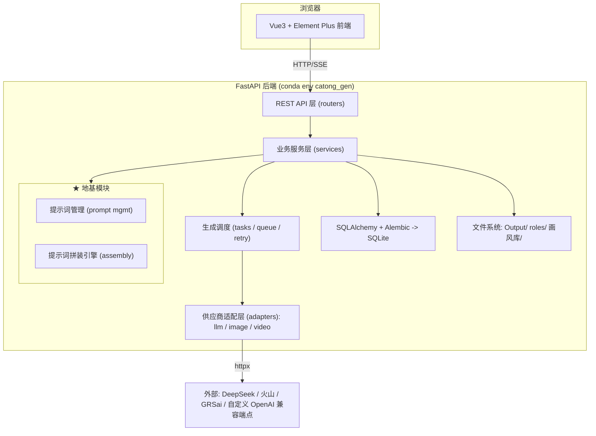

# 01 - 项目总览与技术选型

## 1. 项目定位

**catong_gen（卡通生成器）** 是对桌面应用 **雪漫画（CineGacha）v1.8.16.26** 的 Web 化复刻：将小说/网文原文经 AI 流水线自动转化为**全彩条漫分镜图片**与**动漫短视频**。

与源应用的本质差异只有一条：**桌面 GUI（PyQt6）-> Web 应用（B/S 架构）**。业务能力对等复刻，且优先实现其中最核心、最能沉淀资产的子系统能力--**提示词管理与提示词拼装**。

### 1.1 对标源应用要点（逆向取证结论）

| 维度 | 源应用（雪漫画） | 本项目（catong_gen） |
|------|----------------|---------------------|
| 形态 | Windows 桌面应用（PyQt6，PyInstaller+PyArmor） | Web 应用（Vue3 + FastAPI） |
| 语言运行时 | Python 3.9（python39.dll） | **Python 3.11（conda env `catong_gen`）** |
| 数据存储 | SQLite（22 张表）+ 文件系统 | SQLite（SQLAlchemy 2.x + Alembic）+ 文件系统（保持本地优先） |
| LLM 接入 | DeepSeek/GRSai/火山/OpenRouter/Coze/Flow/Grok/Gemini… | 统一为 OpenAI 兼容适配层 + 多供应商路由（首期 DeepSeek/火山/自定义 OpenAI 兼容端点） |
| 图像接入 | 即梦/火山/GRSai(nano-banana)/多米/Uumoshi… | 图像供应商抽象层（首期 GRSai/OpenAI 兼容图像端点 + 自定义池） |
| 代码保护 | PyArmor + xmh_guard | 不需要（自有代码） |
| 授权/账号 | Token 授权、机器指纹 | 不复刻（改为简单的本地使用，无鉴权或单用户口令） |

### 1.2 复刻范围（全部功能域）

以源应用功能域为清单基线（详见 [02-功能清单与流程设计.md](02-功能清单与流程设计.md)）：

1. 小说中心（导入/抓取/清洗/多标签页管理）
2. AI 文本处理管线（清洗->角色提取->文案改写->分镜脚本->开场白->小说评分）
3. 角色中心（AI 角色视觉推导、三视图、参考图、标签、道具/场景资产）
4. 项目与分镜编辑器（manga 漫画模式 / camera 视频模式）
5. **提示词管理模块（★ 本项目第一期重点）**
6. 提示词拼装引擎（★ 本项目第一期重点）
7. 画风库
8. 图片生成调度（供应商池、候选图、批量、失败重试/模型链降级）
9. 高清放大（Real-ESRGAN，后期）
10. TTS 配音工程
11. 视频生成与合成（FFmpeg、剪映草稿导出）
12. 导出与发布（长图拼接、打包、手机推送 ADB/HDC，后期）
13. 一键漫剧（端到端自动化，后期）
14. 设置中心（供应商 Key、生成参数、并发等）

**不复刻项**：源应用的付费授权/加密体系（PyArmor/xmh_guard/VIP 加密画风包 cg2）、自动更新器、LOFTER/雪崩平台发布（列为后期可选）。

## 2. 技术选型

### 2.1 后端（Python 3.11）

| 类别 | 选型 | 版本基线 | 理由 |
|------|------|---------|------|
| 语言 | Python | **3.11**（用户要求；conda env `catong_gen`） | 性能优于 3.9，生态完整 |
| Web 框架 | FastAPI | ≥0.110 | 原生 async、Pydantic 校验、自动 OpenAPI 文档、SSE 支持好 |
| 数据校验 | Pydantic | v2 | 与 FastAPI 一体 |
| ORM | SQLAlchemy | 2.x | 对标源应用（源库即 SQLAlchemy），支持同步+异步 |
| 迁移 | Alembic | ≥1.13 | 表结构演进 |
| 数据库 | SQLite | 内置 | 本地优先，零部署；后期可换 PostgreSQL |
| HTTP 客户端 | httpx | ≥0.27 | async 调用 LLM/图像 API |
| 模板渲染 | Jinja2 | ≥3.1 | 提示词模板 `{{ }}` 渲染（拼装引擎） |
| 任务调度 | APScheduler + asyncio.Queue | ≥3.10 | 批量生成、异步任务轮询；首期不引入 Celery/Redis |
| 实时进度 | SSE（sse-starlette） | ≥2.0 | 生成进度推送到浏览器 |
| 图像处理 | Pillow | ≥10 | 拼图/缩略图/水印 |
| 日志 | loguru | ≥0.7 | 结构化日志 |
| 测试 | pytest + httpx | ≥8 | 接口与拼装引擎单测 |

**明确不引入（首期）**：NumPy/Pandas/OpenCV/PyAV--它们服务于高清放大与视频合成（Phase 8+），届时按需加入，保持环境轻量。

### 2.2 前端

| 类别 | 选型 | 理由 |
|------|------|------|
| 框架 | Vue 3 + Vite | 组合式 API，生态成熟 |
| UI 库 | Element Plus | 中文生态、表格/表单/抽屉组件齐全，适合管理型界面 |
| 状态 | Pinia | 官方推荐 |
| 路由 | Vue Router 4 | |
| HTTP | axios | |

### 2.3 运行环境

- **conda 虚拟环境名 = 项目名 = `catong_gen`**（用户要求），Python 3.11。
- 创建命令：`conda create -n catong_gen python=3.11 -y`（已创建：`D:\Users\ThinkPad\miniconda3\envs\catong_gen`）。
- 后端依赖：`requirements.txt`（pip 安装到 conda env）。
- 前端依赖：`frontend/package.json`（npm 安装，Node ≥18）。
- 一键启动：`scripts/dev.bat`（激活 conda env -> uvicorn；另开终端 `npm run dev`）。

## 3. 总体架构

### 3.1 分层架构图



### 3.2 后端代码目录

```
catong_gen/
├── backend/
│   ├── app/
│   │   ├── main.py                 # FastAPI 入口
│   │   ├── config.py               # 配置（env / settings 表）
│   │   ├── database.py             # SQLAlchemy engine/session
│   │   ├── models/                 # ORM 模型（对标源库并扩展）
│   │   │   ├── novel.py            # novels / novel_sections
│   │   │   ├── project.py          # projects / scripts
│   │   │   ├── role.py             # roles / role_tags / category_tags
│   │   │   ├── prompt.py           # ★ prompts / snippets / templates / presets / render_logs
│   │   │   ├── art_style.py        # art_styles（画风库）
│   │   │   ├── provider.py         # providers / provider_accounts（账号池）
│   │   │   ├── task.py             # image_tasks / video_tasks / hd_tasks
│   │   │   └── setting.py          # settings (K/V)
│   │   ├── schemas/                # Pydantic 模型
│   │   ├── routers/                # API 路由（按模块分文件）
│   │   │   ├── prompts.py          # ★ 提示词库/模板/片段/预设
│   │   │   ├── assemble.py         # ★ 拼装预览/调试
│   │   │   ├── novels.py
│   │   │   ├── roles.py
│   │   │   ├── projects.py
│   │   │   ├── scripts.py
│   │   │   ├── images.py
│   │   │   └── settings.py
│   │   ├── services/               # 业务服务
│   │   │   ├── text_pipeline.py    # 清洗/改写/分镜编排
│   │   │   ├── role_service.py
│   │   │   ├── derive_service.py   # 图片提示词推导（LLM）
│   │   │   └── export_service.py   # 拼图/打包
│   │   ├── prompt_engine/          # ★ 拼装引擎（纯函数，可单测）
│   │   │   ├── context.py          # AssemblyContext 构建
│   │   │   ├── segments.py         # 分段定义与解析
│   │   │   ├── renderer.py         # Jinja2 渲染 + 变量解析
│   │   │   └── assembler.py        # 管线编排（拼装入口）
│   │   ├── adapters/               # 供应商适配
│   │   │   ├── llm/                # openai_compat.py / deepseek.py / volcengine.py
│   │   │   └── image/              # base.py / grsai.py / openai_compat.py
│   │   ├── scheduler/              # 生成队列/重试/模型链
│   │   └── seeds/                  # 种子数据（含源库 13 条提示词迁移）
│   ├── alembic/                    # 迁移
│   ├── tests/
│   └── requirements.txt
├── frontend/                       # Vue3 + Vite + Element Plus
├── 设计文档/                        # 本设计文档集
├── scripts/                        # dev.bat / seed.bat 等
├── environment.yml                 # conda env 描述（name: catong_gen）
```

## 4. 关键设计原则（源应用经验继承）

1. **提示词与业务解耦**：源应用把 13 条指令存 `prompts` 表、推导预设存 settings、项目级前后缀存 `projects`。本项目将其体系化为"库/模板/片段/预设/变量"五件套（见文档 05/06），业务代码永不硬编码提示词。
2. **本地优先**：SQLite + 文件系统，全部产物落本地目录（`Output/<project>/<episode>/image/`），与源应用一致。
3. **双模式分表 -> 单表+mode**：源应用 `scripts_list`/`scripts_camera` 双表避免稀疏列；Web 版改为 `scripts` 单表 + `mode` + `extra` JSON（详见文档 04 取舍说明）。
4. **任务表驱动异步**：源应用任务表基本闲置、结果直存分镜行；Web 版必须任务表驱动（HTTP 请求即返回 task_id，前端轮询/SSE），`image_tasks` 等表真正承担状态机职责。
5. **供应商可替换**：所有 LLM 走 OpenAI 兼容协议，所有图像服务走统一 ImageProvider 抽象，模型链降级（源应用 batch_hang_model_chain 思想）作为调度器策略保留。
