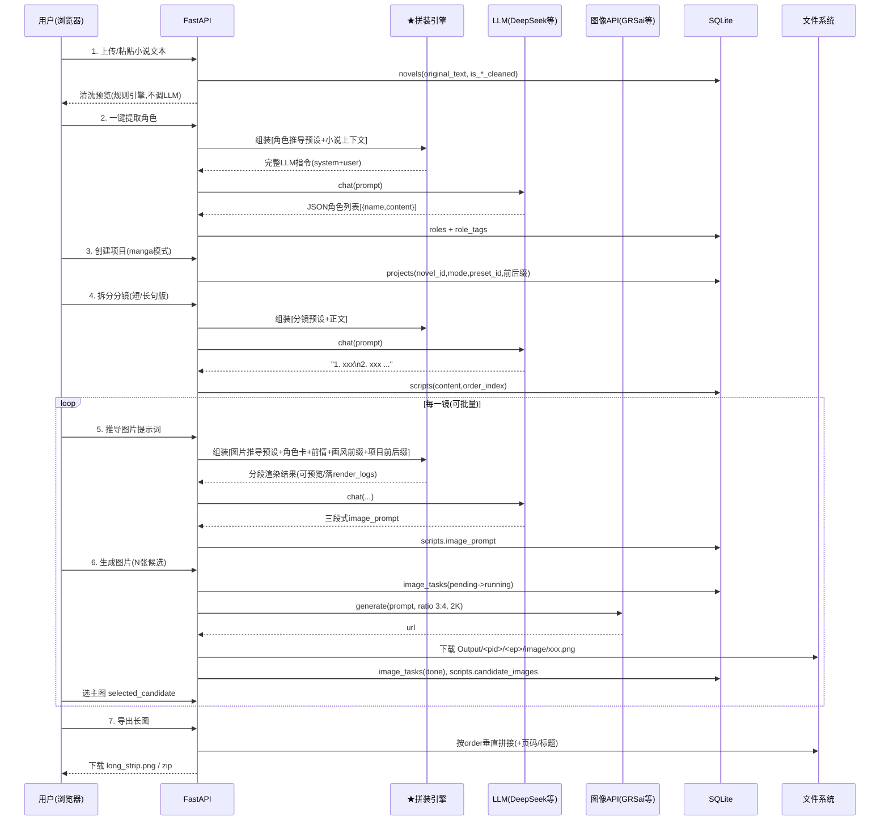

# 03 - 核心流程设计（一条简单主线）

> 用户要求："一个简单核心流程"。本章给出 catong_gen 的**最小可用主线**：从一篇小说文本到一张可发布的条漫长图。所有高级功能（视频、配音、批量、画风链）都是这条主线的旁路扩展。

## 一、核心流程总览（7 步）

```
【第0步】配置供应商        填一次 LLM / 图像 API Key（设置中心）
        │
【第1步】导入小说    ──►  TXT/粘贴 -> 清洗（格式/连载号/标点）
        │
【第2步】提取角色    ──►  LLM（角色推导预设）-> 角色卡列表（含年龄段拆分）
        │
【第3步】创建项目    ──►  绑小说 + 模式 manga + 推导预设 + 项目前后缀
        │
【第4步】拆分分镜    ──►  LLM（分镜预设：短句版/长句版）-> 编号分镜列表
        │
【第5步】推导图片提示词 ─► LLM（图片推导预设 + 角色卡/前情注入）-> 三段式 image_prompt
        │
【第6步】生成图片    ──►  图像 API（供应商池）-> 候选图 N 张 -> 点选主图
        │
【第7步】导出        ──►  长图拼接 / ZIP 打包
```

**一句话**：`小说 → 清洗 → 角色卡 → 分镜 → 提示词 → 候选图 → 长图`。

## 二、流程图（含数据落点）



## 三、每一步与提示词体系的关系（★ 拆解要点）

| 步骤 | 使用的提示词资产 | 注入的上下文变量 | 产出 |
|------|----------------|----------------|------|
| 2 角色推导 | 预设 `role_derive`（源自"VIP智能角色推导"） | `{{novel_text}}` | roles.content（视觉描述） |
| 4 分镜拆分 | 预设 `storyboard_short` / `storyboard_long`（源自 prompts#9/#10） | `{{novel_text}}` | scripts.content |
| 5 图片提示词推导 | 预设 `image_derive`（对标 plot_manga_fusion_bw） | `{{style_prefix}} {{project_summary}} {{roles_cards}} {{prev_shots}} {{shot_content}} {{project_affix}}` | scripts.image_prompt（三段式） |
| 6 图片生成 | （非 LLM，直接下发） | image_prompt + 参考图 | 候选图 |

> 关键结论：**第 2/4/5 步在工程上是同一件事**--`预设 + 上下文 -> 拼装引擎 -> LLM -> 结构化落库`。差别只在预设与变量。这就是把提示词管理放在 Phase 1 的原因：做完它，后面每一步都只是"换模板换变量"。

## 四、image_prompt 三段式（对标源库实证）

从源库 `scripts_list.image_prompt` 逐字取样，每镜提示词由三段构成（`\n\n` 分隔）：

```
第一段【画风+多格场景总述】
韩系商业条漫画风，2D清透上色。多格构图：上方主格，纪澄与谢煜扬并肩走在南州旧街巷…
（画面内容、机位、旁白框位置）

第二段【版式逻辑详解】
本镜采用"主格+两碎格"的三格横条版式，上部主格约占五成半…阅读动线为左上主格->左下碎格->右下碎格…
（格子比例、动线、色彩规范、字框样式 #1a1a1a、无气泡无拟声词）

第三段【固定负面后缀】
禁止：图片右下角出现腾讯动漫 17173 等其他机构水印！
```

推导预设（Phase 5 实现）即要求 LLM 按此三段结构输出；负面后缀作为**片段（snippet）**统一管理，拼装时强制附加。

## 五、状态机

### 5.1 分镜（scripts）

```
empty ──(拆分分镜)──► drafted ──(推导提示词)──► prompted ──(生成图片)──► imaged
                         │                         │                 │
                         └──(重新拆分,保留确认)──── ┴─(重新推导)────── ┴─(重新生成/换候选)
锁定：is_main_locked=1 后批量生成跳过
```

### 5.2 图片任务（image_tasks）

```
pending -> running -> done
   │          │
   │          └── failed ──(重试/模型链降级)──> running
   └──(取消)──> cancelled
```

### 5.3 小说文本管线（novels 字段）

```
original_text ──清洗──► is_format/serial/punct_cleaned=1
                ──AI──► character_text（角色）
                ──AI──► revised_text（改写，可选旁路）
                ──AI──► script_text（分镜脚本）
                ──AI──► storyboard_text（细化分镜，可选）
```

每阶段独立 `*_updated_at` 时间戳，支持单独重跑不覆盖其它阶段（对齐源库设计）。

## 六、错误与旁路

- LLM 返回非法 JSON（角色推导）：自动重试 1 次 -> 仍失败则降级为纯文本行解析（`名称：描述`）-> 手工建卡兜底。
- 图像生成失败：image_tasks.failed + 错误信息 -> 手动重试 / 模型链切换（Phase 8）。
- 分镜含敏感词被拒：标记该镜 notes，跳过继续批量。
