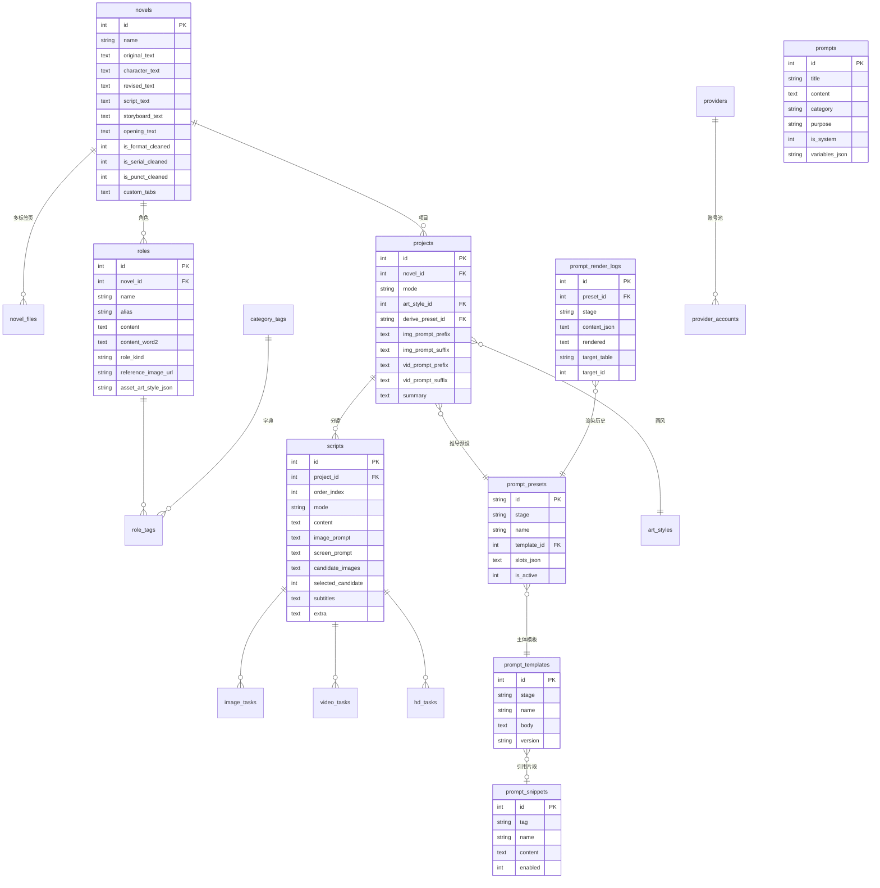

# 04 - 数据库设计

> 基线：源库（SQLite，22 表）逐表取证 + Web 化改进。ORM：SQLAlchemy 2.x；迁移：Alembic。
> ★ 标注的表属于提示词体系（第一期）。

## 一、ER 总览



## 二、表清单与源库对照

| 新表 | 源库对应 | 变化说明 |
|------|---------|---------|
| ★ prompts | prompts（13 条） | 增加 purpose（业务阶段标签）、variables_json（变量声明）、enabled；内容种子迁移 |
| ★ prompt_snippets | 无（散落硬编码，如负面后缀、三视图渲染词） | 新增：可复用片段（画风前缀/负面后缀/质量词） |
| ★ prompt_templates | manga_derive_prompt_defaults 等（代码内） | 新增：带 `{{ }}` 占位符的模板 |
| ★ prompt_presets | settings.manga_derive_preset_id + presets 代码 | 新增：预设（阶段+模板+槽位），支持 6 自定义槽（对标 derive_custom_slot_1..6） |
| ★ prompt_render_logs | manga_derive_llm_raw_log（开关日志） | 新增：每次拼装留痕，可回放 |
| novels | novels | 保留全部多阶段字段；custom_tabs 保持 JSON |
| novel_files | custom_tabs（JSON 内） | 拆出独立表（原文1/原文2 分卷），结构化 split_index/anchor_tab |
| projects | projects | 画风由 settings 移入外键 art_style_id；derive_preset_id 指向 prompt_presets |
| scripts | scripts_list + scripts_camera（双表） | **合并为单表 + mode + extra JSON**（取舍见下） |
| roles | roles | 保留（去掉 jimeng 专有列 video_preview_json 等冗余，收进 extra） |
| role_tags / category_tags | 同名 | 保留，category_tags 种子迁移（类型/时空） |
| art_styles | styles_mapping.json（159 条文件） | 入库：name/categories/local_path/is_new/source |
| providers | settings（enable_xxx_service） | 新增供应商注册表（llm/image/tts，base_url/协议类型） |
| provider_accounts | settings 里的 api key + jimeng_tokens_* | 统一账号池（api_key/备注/有效/额度/最后校验） |
| image_tasks | image_tasks（源库闲置） | 真正启用：状态机 + result_url + local_path |
| video_tasks | video_tasks | 同上（Phase 9） |
| hd_tasks | hd_tasks | 同上（Phase 10） |
| dubbings / tts_voices | 同名（空表） | Phase 9 |
| settings | settings（K/V 42 项） | 保留 K/V（导出目录/并发/超时/默认模型等） |
| schema_migrations | _cinegacha_migrations | 由 Alembic 接管 |

### scripts 单表取舍说明

源应用为 manga/camera 双表（避免稀疏列）。Web 版合并原因：
1. 分镜列表/排序/导入导出等 80% 字段两模式共用（content、subtitles、order_index、notes…）；
2. 模式差异字段（manga: image_prompt/candidate_images/screen_prompt；camera: first_frame/last_frame/duration）数量小，放 `extra JSON`；
3. 换取"一个分镜编辑器组件通吃两模式"的前端收益。
若后期 camera 字段膨胀，再拆 `scripts_camera`（迁移成本低，extra JSON 可搬）。

## 三、核心表 DDL（首期建表集）

### 3.1 提示词五件套 ★

```sql
-- 提示词库（对标源 prompts 表，种子=源库 13 条）
CREATE TABLE prompts (
    id            INTEGER PRIMARY KEY AUTOINCREMENT,
    title         TEXT NOT NULL,
    content       TEXT NOT NULL,
    category      TEXT NOT NULL DEFAULT '未分类',   -- 场景描述/角色设定/画风描述/对话生成/情节发展/VIP
    purpose       TEXT NOT NULL DEFAULT 'generic',  -- 业务阶段: role_derive/storyboard/image_derive/...
    variables_json TEXT DEFAULT '[]',               -- 声明变量 [{"name":"novel_text","desc":"小说正文"}]
    is_system     INTEGER NOT NULL DEFAULT 0,       -- 1=系统内置(可被保护)
    enabled       INTEGER NOT NULL DEFAULT 1,
    created_at    TIMESTAMP DEFAULT CURRENT_TIMESTAMP,
    updated_at    TIMESTAMP DEFAULT CURRENT_TIMESTAMP
);

-- 片段：可复用小块（负面后缀/画风前缀/质量词）
CREATE TABLE prompt_snippets (
    id         INTEGER PRIMARY KEY AUTOINCREMENT,
    tag        TEXT NOT NULL,              -- negative / style_prefix / quality / layout
    name       TEXT NOT NULL,
    content    TEXT NOT NULL,
    enabled    INTEGER NOT NULL DEFAULT 1,
    sort_order INTEGER NOT NULL DEFAULT 0,
    created_at TIMESTAMP DEFAULT CURRENT_TIMESTAMP,
    updated_at TIMESTAMP DEFAULT CURRENT_TIMESTAMP
);

-- 模板：某业务阶段的主体指令，Jinja2 语法
CREATE TABLE prompt_templates (
    id      INTEGER PRIMARY KEY AUTOINCREMENT,
    stage   TEXT NOT NULL,                 -- role_derive/storyboard_short/.../image_derive
    name    TEXT NOT NULL,
    body    TEXT NOT NULL,                 -- 含 {{ style_prefix }} {{ novel_text }} 等
    version INTEGER NOT NULL DEFAULT 1,
    created_at TIMESTAMP DEFAULT CURRENT_TIMESTAMP,
    updated_at TIMESTAMP DEFAULT CURRENT_TIMESTAMP
);

-- 预设：阶段 + 模板 + 槽位（对标 manga_derive_presets / plot_manga_fusion_bw）
CREATE TABLE prompt_presets (
    id          TEXT PRIMARY KEY,          -- 如 plot_manga_fusion_bw / storyboard_short_v1
    stage       TEXT NOT NULL,
    name        TEXT NOT NULL,
    template_id INTEGER NOT NULL REFERENCES prompt_templates(id),
    slots_json  TEXT NOT NULL DEFAULT '{}', -- 槽位值 {"custom_1":"..."} + 附着片段 ["negative_watermark"]
    is_system   INTEGER NOT NULL DEFAULT 0,
    is_active   INTEGER NOT NULL DEFAULT 0, -- 每阶段一个激活预设
    created_at  TIMESTAMP DEFAULT CURRENT_TIMESTAMP,
    updated_at  TIMESTAMP DEFAULT CURRENT_TIMESTAMP
);

-- 渲染历史（拼装留痕）
CREATE TABLE prompt_render_logs (
    id           INTEGER PRIMARY KEY AUTOINCREMENT,
    preset_id    TEXT,
    stage        TEXT NOT NULL,
    context_json TEXT,                      -- 输入变量快照
    rendered     TEXT,                      -- 最终拼装结果
    target_table TEXT,                      -- scripts / roles ...
    target_id    INTEGER,
    created_at   TIMESTAMP DEFAULT CURRENT_TIMESTAMP
);
```

### 3.2 小说与项目

```sql
CREATE TABLE novels (
    id INTEGER PRIMARY KEY AUTOINCREMENT,
    name TEXT NOT NULL,
    content TEXT,                    -- 当前工作正文（=original_text 快照）
    original_text TEXT,
    character_text TEXT, revised_text TEXT, script_text TEXT,
    storyboard_text TEXT, opening_text TEXT,
    character_updated_at TIMESTAMP, revised_updated_at TIMESTAMP,
    script_updated_at TIMESTAMP, storyboard_updated_at TIMESTAMP,
    custom_tabs TEXT DEFAULT '{}',   -- 兼容源结构；新数据走 novel_files
    is_format_cleaned INTEGER DEFAULT 0,
    is_serial_cleaned INTEGER DEFAULT 0,
    is_punct_cleaned INTEGER DEFAULT 0,
    is_shot_cleaned INTEGER DEFAULT 0,
    share_url TEXT DEFAULT '',
    score_value INTEGER, score_report TEXT,
    created_at TIMESTAMP DEFAULT CURRENT_TIMESTAMP,
    updated_at TIMESTAMP DEFAULT CURRENT_TIMESTAMP
);

CREATE TABLE novel_files (           -- 源 custom_tabs 的结构化版本
    id INTEGER PRIMARY KEY AUTOINCREMENT,
    novel_id INTEGER NOT NULL REFERENCES novels(id) ON DELETE CASCADE,
    slot_key TEXT NOT NULL,          -- custom_1 / custom_2
    name TEXT NOT NULL,              -- 原文1 / 原文2
    content TEXT NOT NULL,
    anchor_tab TEXT DEFAULT 'original',
    split_index INTEGER DEFAULT 1,
    updated_at TIMESTAMP DEFAULT CURRENT_TIMESTAMP
);

CREATE TABLE projects (
    id INTEGER PRIMARY KEY AUTOINCREMENT,
    name TEXT NOT NULL,
    novel_id INTEGER REFERENCES novels(id),
    mode TEXT NOT NULL DEFAULT 'manga',        -- manga / camera
    art_style_id INTEGER REFERENCES art_styles(id),
    derive_preset_id TEXT REFERENCES prompt_presets(id),
    summary TEXT DEFAULT '',
    img_prompt_prefix TEXT DEFAULT '',
    img_prompt_suffix TEXT DEFAULT '',
    vid_prompt_prefix TEXT DEFAULT '',
    vid_prompt_suffix TEXT DEFAULT '',
    sync_roles_from_novel INTEGER DEFAULT 0,
    episode_count INTEGER DEFAULT 1,
    created_at TIMESTAMP DEFAULT CURRENT_TIMESTAMP,
    updated_at TIMESTAMP DEFAULT CURRENT_TIMESTAMP
);
```

### 3.3 分镜与任务

```sql
CREATE TABLE scripts (
    id INTEGER PRIMARY KEY AUTOINCREMENT,
    project_id INTEGER NOT NULL REFERENCES projects(id) ON DELETE CASCADE,
    mode TEXT NOT NULL DEFAULT 'manga',
    order_index INTEGER NOT NULL DEFAULT 0,
    shot_id INTEGER, shot_index INTEGER,
    content TEXT,                       -- 画面内容（分镜文本）
    subtitles TEXT DEFAULT '[]',        -- 台词 JSON [{text,duration,start,end}]
    image_prompt TEXT DEFAULT '',       -- 三段式推导产物
    video_prompt TEXT DEFAULT '',
    screen_prompt TEXT DEFAULT '',      -- 屏幕字/花字提示词
    main_image TEXT,                    -- 主图路径
    candidate_images TEXT DEFAULT '{}', -- {"0":"path1","1":"path2"}
    selected_candidate INTEGER,
    reference_image TEXT, reference_image_local TEXT,
    notes TEXT DEFAULT '',
    is_main_locked INTEGER DEFAULT 0,
    generation_enabled INTEGER DEFAULT 1,
    time_range TEXT, duration REAL,
    extra TEXT DEFAULT '{}',            -- camera: first_frame/last_frame 等
    created_at TIMESTAMP DEFAULT CURRENT_TIMESTAMP,
    updated_at TIMESTAMP DEFAULT CURRENT_TIMESTAMP
);

CREATE TABLE image_tasks (
    id INTEGER PRIMARY KEY AUTOINCREMENT,
    task_id TEXT UNIQUE,
    script_id INTEGER REFERENCES scripts(id) ON DELETE CASCADE,
    project_id INTEGER,
    status TEXT NOT NULL DEFAULT 'pending',  -- pending/running/done/failed/cancelled
    provider TEXT, model TEXT,
    aspect_ratio TEXT, resolution TEXT,
    prompt_digest TEXT,                     -- 拼装结果摘要（全文在 render_logs）
    image_url TEXT, image_path TEXT,
    error TEXT, retry_count INTEGER DEFAULT 0,
    created_at TIMESTAMP DEFAULT CURRENT_TIMESTAMP,
    updated_at TIMESTAMP DEFAULT CURRENT_TIMESTAMP,
    completed_at TIMESTAMP
);
```

### 3.4 角色 / 标签 / 画风 / 供应商 / 设置

```sql
CREATE TABLE roles (
    id INTEGER PRIMARY KEY AUTOINCREMENT,
    novel_id INTEGER REFERENCES novels(id),
    project_id INTEGER,
    name TEXT NOT NULL, alias TEXT DEFAULT '',
    content TEXT,                    -- 视觉描述（注入提示词的角色卡）
    content_word2 TEXT,              -- 三视图/精修提示词
    role_kind TEXT DEFAULT 'library',-- library/asset
    cover_path TEXT, reference_image_url TEXT,
    portrait_previews_json TEXT DEFAULT '[]',
    asset_art_style_json TEXT,
    audio_path TEXT, order_index INTEGER DEFAULT 0,
    extra TEXT DEFAULT '{}',
    created_at TIMESTAMP DEFAULT CURRENT_TIMESTAMP,
    updated_at TIMESTAMP DEFAULT CURRENT_TIMESTAMP
);

CREATE TABLE category_tags (         -- 种子迁移源库 8 条（类型/时空）
    id INTEGER PRIMARY KEY AUTOINCREMENT,
    category TEXT NOT NULL, tag_value TEXT NOT NULL,
    display_order INTEGER DEFAULT 0
);
CREATE TABLE role_tags (
    id INTEGER PRIMARY KEY AUTOINCREMENT,
    role_id INTEGER NOT NULL REFERENCES roles(id) ON DELETE CASCADE,
    tag_category TEXT NOT NULL, tag_value TEXT NOT NULL
);

CREATE TABLE art_styles (            -- 种子=源画风库 styles_mapping.json 159 条
    id INTEGER PRIMARY KEY AUTOINCREMENT,
    name TEXT NOT NULL, categories_json TEXT DEFAULT '[]',
    preview_path TEXT, source_url TEXT,
    is_new INTEGER DEFAULT 0, is_vip INTEGER DEFAULT 0,
    enabled INTEGER DEFAULT 1
);

CREATE TABLE providers (
    id INTEGER PRIMARY KEY AUTOINCREMENT,
    kind TEXT NOT NULL,              -- llm / image / video / tts
    code TEXT NOT NULL UNIQUE,       -- deepseek / volcengine / grsai / openai_compat
    name TEXT NOT NULL,
    base_url TEXT, protocol TEXT DEFAULT 'openai_compat',
    enabled INTEGER DEFAULT 1
);
CREATE TABLE provider_accounts (     -- 统一源库 settings.*_api_key + jimeng_tokens_*
    id INTEGER PRIMARY KEY AUTOINCREMENT,
    provider_code TEXT NOT NULL,
    api_key TEXT NOT NULL,
    remark TEXT DEFAULT '',
    valid INTEGER DEFAULT 1,
    quota_json TEXT, last_checked TIMESTAMP,
    created_at TIMESTAMP DEFAULT CURRENT_TIMESTAMP
);

CREATE TABLE settings (              -- 保留 K/V
    key TEXT PRIMARY KEY,
    value TEXT
);
```

## 四、种子数据清单（Phase 1/2/3/8 落地）

| 种子 | 来源 | 内容 |
|------|------|------|
| prompts 13 条 | 源库 prompts 表（`_inspect/prompts.json`） | 小说视频提示词指令/获取人物形象/角色三视图/人物形象视频/图片推导词默认前后缀/视频推导词默认前后缀/分镜短长文本版/一键对话/文案同义改写/VIP智能角色推导 |
| prompt_snippets | 源库实证 | 负面后缀"禁止：图片右下角出现腾讯动漫 17173 等其他机构水印！"；图片推导默认前缀"顶级韩漫风格，融合精致日系2D插画美学…"；三视图渲染词（取自 roles.content_word2 公共段） |
| prompt_presets | 对标 plot_manga_fusion_bw | image_derive / storyboard_short / storyboard_long / role_derive / dialogue_split / rewrite 等首期 6 个 |
| category_tags 8 条 | 源库 | 类型（角色/场景/道具）、时空（古代/现代/科幻/玄幻/ABO） |
| art_styles 159 条 | 源画风库 styles_mapping.json | 含分类与预览图（复制 webp 至本地） |
| settings | 源库合理化 | 并发=5、比例=3:4、分辨率=2K、默认推理模型、导出目录 |
